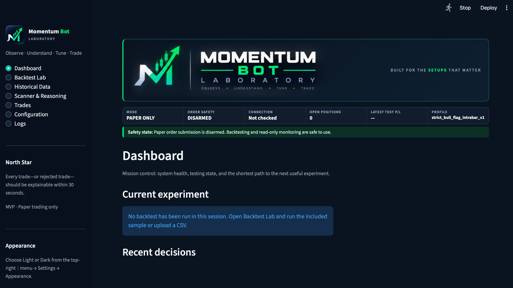
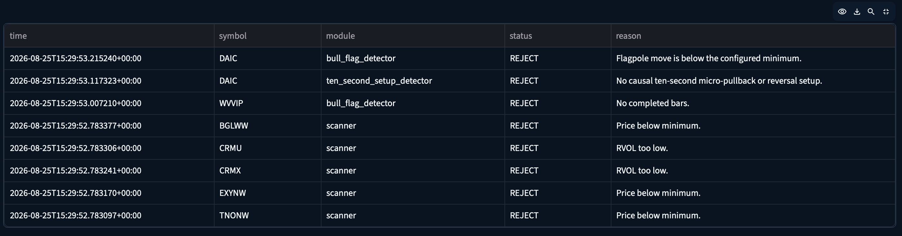
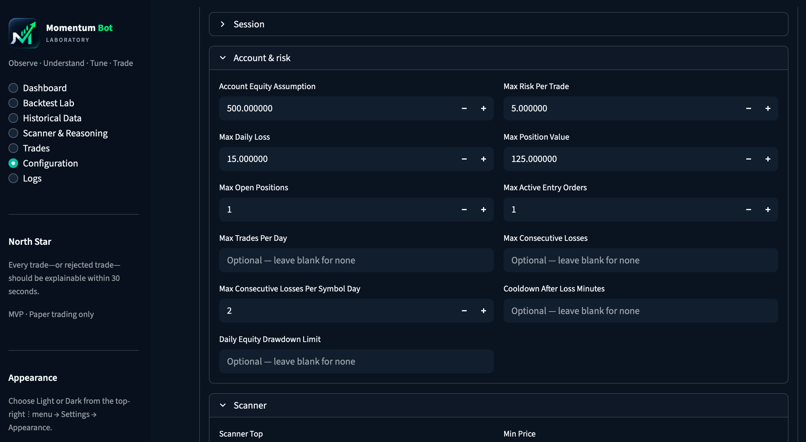
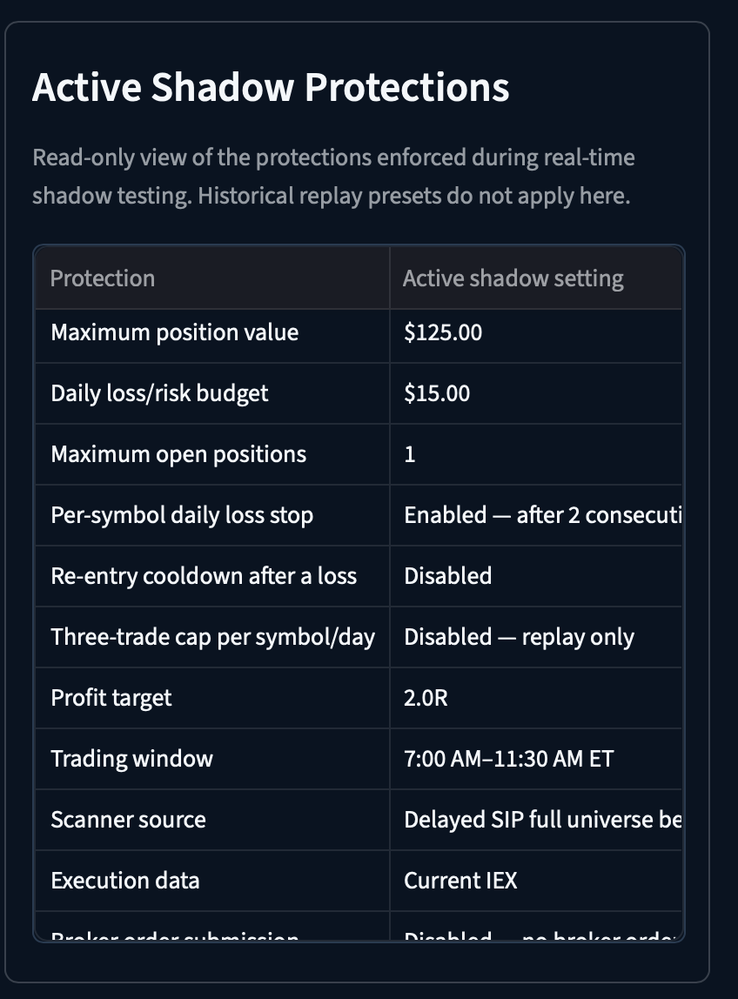
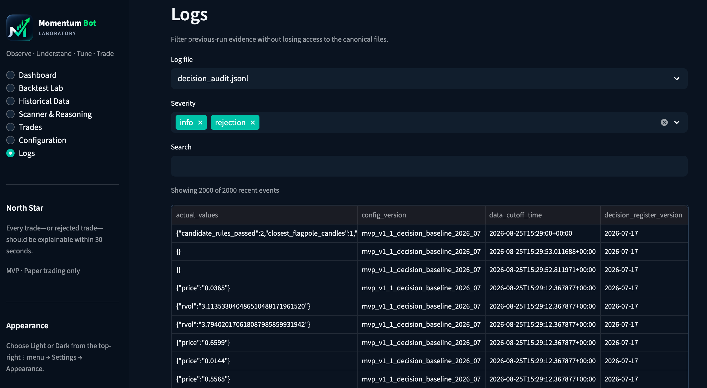

# Momentum Bot Laboratory

Momentum Bot Laboratory is an educational Python application for studying a
momentum strategy with historical data, simulated fills, and Alpaca paper
trading. It is under active development, does not claim profitability, and is
not financial advice.

The application is paper-only. Its Alpaca trading clients are constructed with
`paper=True`, live-mode configuration is rejected, and paper order submission
has a separate interlock that defaults to disabled. No code path in this
repository is intended to submit a live brokerage order.

## Safety model

- `ALPACA_PAPER` must remain `true`.
- `ALLOW_LIVE_TRADING` must remain `false`.
- `PAPER_ORDER_SUBMISSION_ENABLED` defaults to `false`.
- Shadow mode uses market data with local simulated fills and refuses to start
  when the paper-submission interlock is enabled.
- Existing broker orders or positions halt new entries for manual review.
- The Streamlit dashboard binds to `127.0.0.1` and hides account balances and
  position details by default.

Setting `PAPER_ORDER_SUBMISSION_ENABLED=true` can submit orders only to an
Alpaca paper account. Do this only after reviewing the configuration, tests, and
paper-account state. Changing the project to support live trading is outside
its supported scope and would require a separate security and risk review.

## Application Screenshots

These screens show the implemented local application interface. Momentum Bot
Laboratory remains paper-trading software under active development; the views
below are not evidence of profitability or readiness for live trading.

### Dashboard overview



The dashboard provides an operational overview of the current experiment,
paper-trading status, connection state, and recent strategy decisions while
keeping paper order submission visibly disarmed.

### Strategy analysis and decision reasoning



The decision table records how market observations move through scanner and
strategy criteria, including explicit rejection reasons that make evaluation
outcomes easier to inspect.

### Configuration and risk controls



The configuration workspace exposes adjustable research and paper-trading
parameters. Changes are validated before they apply to the GUI session, while
credentials and live-trading safety fields remain non-editable.

#### Active shadow protections



The read-only protections view summarizes the controls enforced during
real-time shadow simulation, including position and loss limits, the trading
window, and disabled broker-order submission.

### Execution and audit logs



The logs workspace filters structured decision and execution evidence by file,
severity, and search text to support troubleshooting and traceable review while
preserving the canonical event files.

## Requirements

- Python 3.11 or 3.12
- An Alpaca paper account only for commands that connect to Alpaca

The test suite and sample backtest do not require credentials.

## Installation

```bash
python3.12 -m venv .venv
source .venv/bin/activate
python -m pip install --requirement requirements.txt
cp .env.example .env
chmod 600 .env
```

`.env.example` contains obvious placeholder values. Add only paper-account
credentials to the ignored `.env` file:

```env
ALPACA_API_KEY=your_paper_api_key_here
ALPACA_SECRET_KEY=your_paper_secret_key_here
ALPACA_PAPER=true
ALLOW_LIVE_TRADING=false
PAPER_ORDER_SUBMISSION_ENABLED=false
GUI_SHOW_ACCOUNT_DETAILS=false
```

Never commit `.env`, paste credentials into an issue, or put real credentials
in screenshots.

## Validate and test

```bash
python -m bot validate
python -m unittest discover -s tests -v
python scripts/audit_public_release.py
```

The public-release audit checks the working tree for secret-like values,
private/generated files, absolute user paths, required safety defaults, and
required public documentation. Maintainers can also audit referenced Git
history before publication:

```bash
python scripts/audit_public_release.py --history
```

## Local workflows

Run the bundled sample backtest:

```bash
python -m bot backtest examples/sample_bull_flag.csv
```

Validate paper credentials without placing an order:

```bash
python -m bot check
```

Run one disarmed market-data and strategy cycle:

```bash
python -m bot run --once
```

Run one real-time shadow cycle with local simulated fills:

```bash
python -m bot shadow --once
```

Launch the local dashboard:

```bash
streamlit run bot/gui.py
```

The repository includes a synthetic validation-manifest example solely to
document the supported CSV format. It is not research data and must not be used
as strategy evidence.

## Repository structure

```text
assets/       Public branding used by the dashboard
bot/          Strategy, safety, broker, backtest, history, and GUI code
Docs/         Application screenshots used by this README
examples/     Synthetic/sample inputs and a manual risk demonstration
launcher/     Portable local macOS shadow-observation launcher
scripts/      Public-release audit tooling
tests/        Automated behavior and safety checks
```

Runtime data is local and ignored:

```text
.env
logs/
output/
private_data/
*.db, *.sqlite3, *.jsonl, *.parquet
```

These paths may contain credentials, account metadata, market observations,
generated trade records, or private research. Review them separately and never
stage them for publication. New log and output files are restricted to the
current OS user where POSIX permissions are available.

## Dashboard privacy

The dashboard is a local tool, not a hosted web application. Keep its loopback
binding in place. By default, account checks show connection status and counts
without balances or position details. `GUI_SHOW_ACCOUNT_DETAILS=true` should be
used only in a private local session. Before sharing any screenshot, inspect the
entire image for account information, positions, symbols, balances, logs,
browser tabs, notifications, and local file paths.

## Current limitations

- This is alpha software under development, not a production trading system.
- Paper behavior does not establish live-market safety or profitability.
- Historical results are sensitive to data quality, survivorship bias,
  slippage assumptions, and bar-level ambiguity.
- The polling and reconciliation paths require continued paper testing.
- Experimental features and parameters require independent validation.
- The bundled example inputs are demonstrations, not performance evidence.

See [SHADOW_TESTING_REVIEW.md](SHADOW_TESTING_REVIEW.md) for the current
forward-testing checkpoint, its evidence limits, and the next bounded research
milestone.

See [SECURITY.md](SECURITY.md) for private vulnerability reporting and the
local-data boundary.

## License

Released under the [MIT License](LICENSE).
